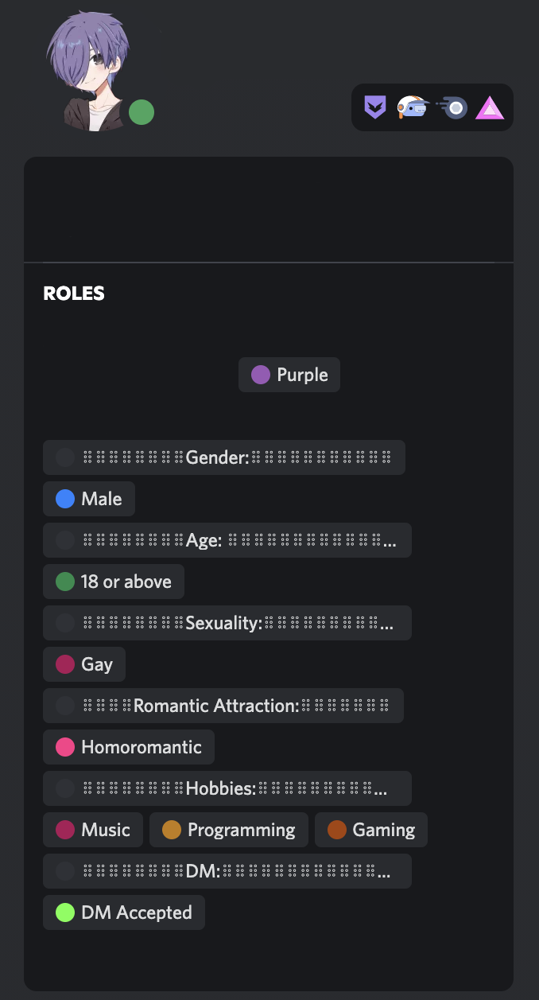
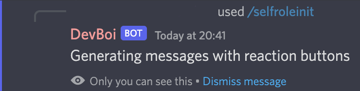
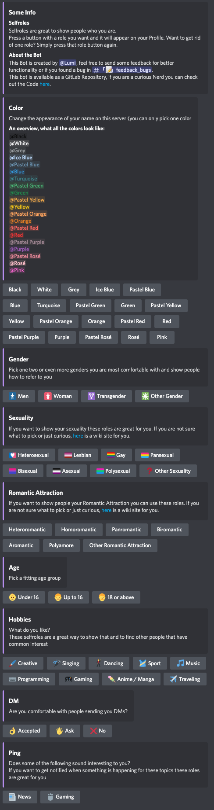
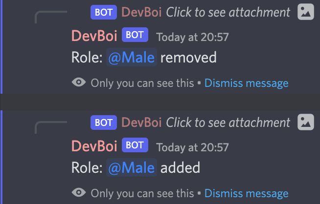

# This is my Discord bot to manage selfroles

Special thanks to Inari, she introduced me to JavaScript and helped me a lot.

Example of what roles and categories look like 



Reaction message from the Bot to you, after you used '/selfroleinit'





Example of the messages from the Bot, after you changed your roles




## Documentation i used

- [Eris](https://abal.moe/Eris/)
- [Discord Message Components](https://discord.com/developers/docs/interactions/message-components)
- [Discord Embed Object](https://discord.com/developers/docs/resources/channel#embed-object)


## NoteJS Stuff I used

```
npm install eris
```

## Config File

This file is hidden in this Repository, because I don't want to share my API Token.

You have to create an `config.js` file, here is an empty config files content:
```JS
module.exports = {
    Token: "",          //Your API Token
    ApplicationID: "",  //The ApplicationID
    PublicKey: "",      //The Public Key
    initRole: "",       //ID of the Role that can use this Bot
    guildID: ""         //ID of the Server
}
```

## Roles

All the contents and setting of the embeds and the buttons are in `role.js`, the file is in this repository and can be used as an example.

### Role Group

Every category is an object array.
Element 0 always contains the settings for the category, what the buttons and the Embed look like.
The rest contains the role names, IDs and other stuff. 

#### Category Settings

This Example here is from the `roles.js` that is in this Repository.

- `title`: the title of the embed message for this group
- `description`: the category description in the embed
- `color`: the color of the embed message
- `ShowRoles`: either true or false, when true it will list all the roles from this Group in the embed
- `ShowEmotes`: buttons can have emotes, simply enable or disable them
- `FieldName`: contains the name of the field used for the role listing
- `AllowMultiple`: either true or false, when true users can have as many roles of the category as they desire at once, if false only one role at one and choosing another role of this category will remove the other ones  

#### Objects in Role group

- `name: ""`: contains the name that the Button will have and always has to be set
- `RoleID`: contains the ID of the role, this also has to be always used.
- `EmoteName: ""`: contains the name of the Emote, in case of a normal Emote the name is just the Emote, if it is a custom emote is has to contain the Emote name
- `EmoteID: ""`: only has to be used if `CustomEmote` is set to `true`, contains the ID of the custom emote
- `CustomEmote: true/false`: Has to be used when using any emotes, set to `true` if you want to use Discord custom emotes, or to `false` when just default emotes are used.

# Use as a systemd service

Save this file as `felix-helper.service` in `/etc/systemd/system/`

```
[Unit]
Description=felix-helper
After=network-online.target
Wants=network-online.target

[Service]
Type=simple
User=root
ExecStart=/usr/bin/node /home/user/path/to/felix-helper/main.js
WorkingDirectory=/home/user/path/to/felix-helper/
Restart=always
RestartSec=120

[Install]
WantedBy=multi-user.target
```
| command                              | function                 |
|--------------------------------------|--------------------------|
| `sudo systemctl start felix-helper`  | start the Bot            |
| `sudo systemctl stop felix-helper`   | stop the Bot             |
| `sudo systemctl enable felix-helper` | enable start Bot on boot |
| `sudo systemctl disable felix-helper` | disable start Bot on boot |

